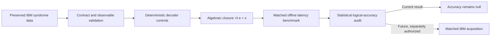

# Hardware-Adaptive Quantum Error Correction on IBM Systems

A fail-closed research programme for reliable, reproducible quantum-error-correction decoding on preserved IBM hardware data. The project combines algebraic decoder validation, reproducible GPU batching, independent decoder controls, and guarded preparation for future matched hardware acquisition.

## Why this work matters

Real-time QEC requires more than a decoder with a favorable point estimate. A trustworthy system must preserve the syndrome equation, reproduce its decisions, meet latency constraints, and demonstrate logical improvement with uncertainty that excludes a null result. This repository separates those claims so that systems performance is not mistaken for physical error suppression.

## Validated results

| Result | Measured outcome | Scope |
|---|---:|---|
| Algebraic syndrome closure | **100%** | 1,536 preserved real-IBM replay shots |
| Batched replay speedup | **2.252x** | 95% CI **[2.135, 2.362]x** |
| Batched latency | **1.461 ms/shot** | Offline matched replay |
| Sequential latency | **3.435 ms/shot** | Offline matched replay |
| V501 corrected logical gain | **+0.455729 percentage points** | 95% CI **[-2.929688, +3.906250] pp**; statistically null |
| V501 raw versus decoded LER | **50.390625% → 49.934896%** | Corrected observable contract; offline replay |

The closure and latency results are defensible systems findings. They do **not** establish below-threshold QEC, physical error suppression, or quantum advantage.

## Independent decoder and representation controls

The corrected V501 PyMatching control provides an independent offline comparison against the project decoder stack. It confirms deterministic replay and graph closure, while the corrected logical-accuracy interval still crosses zero.

A separate sparse 3D space-time GCN experiment found a modest **1.45 percentage-point** improvement over logistic regression, with its confidence interval excluding zero. Its logical error rate was **12.12%**, compared with **12.97%** for an always-zero control and **2.95%** for PyMatching. This shows that space-time structure contains learnable information, but the tested GCN was not competitive with MWPM/PyMatching. The GCN did not produce the closure or GPU-speedup results above.

## Scientific boundary

- Historical V490–V500 logical-accuracy values were withdrawn after V501 identified incorrect observable maps in all 24 audited contracts.
- V501 recomputed accuracy on corrected contracts; the result remains statistically null.
- Relay routing did not meet the **95%** cross-seed production gate. Five-seed consensus retained only **2.864583%** fast-path coverage, and valid seeds disagreed logically on **23.632812%** of shots.
- No claim of physical error suppression, `Lambda > 1`, real-time feedback latency, or accuracy breakthrough is made.

## Execution safety

Live IBM submissions are gated. The repository's preparation and validation work does not authorize a hardware job.

Planned hardware controls, subject to a separate signed go/no-go review, include:

- matched compilation, layout, and dynamical-decoupling provenance across approved backends;
- logical `0`, `1`, `+`, and `-` preparations;
- an `N=0` SPAM calibration baseline;
- variable syndrome-round acquisition;
- backend-measured dynamic-feedforward latency.

These controls are **planned, not yet reported as executed**. In particular, this project does not claim completed `N=0` SPAM inversion or sub-microsecond IBM feedforward.

## Funding objectives

Support would enable four bounded objectives:

1. **Reproducible real-time systems benchmarking** — characterize decoder throughput and end-to-end latency on controlled CPU/GPU environments.
2. **Matched hardware acquisition** — acquire statistically powered, calibration-matched IBM datasets only after protocol and budget authorization.
3. **Robust decoding research** — benchmark deterministic graph decoders and carefully scoped space-time learning methods against strong PyMatching controls.
4. **Open validation infrastructure** — release sanitized schemas, audit checks, and reproducibility artifacts after institutional and security review.

Success will be assessed with preregistered gates: 100% algebraic closure, at least 95% routing agreement where routing is used, matched uncertainty intervals, and no physical-suppression claim unless its confidence bound clears the declared threshold.

## Governance and disclosure

The work is led at Western Sydney University under academic supervision. Results are reported as offline, historical, synthetic, or live-hardware evidence according to their actual provenance.

Public material intentionally excludes:

- API keys, credentials, account identifiers, job-access secrets, and private endpoints;
- private datasets and shot-level records;
- unpublished model weights, proprietary decoder internals, and exploit-ready infrastructure details;
- internal filesystem paths, cluster account details, and unsigned hardware-submission instructions.

No software license is asserted because this repository does not currently contain a license file.

## Current status

The project has a validated offline systems result and a corrected, statistically null logical-accuracy result. IBM hardware acquisition remains gated pending a separate explicit authorization and a frozen matched protocol.